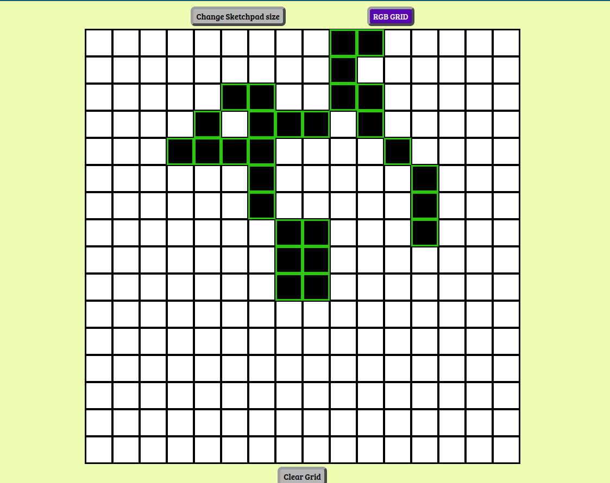
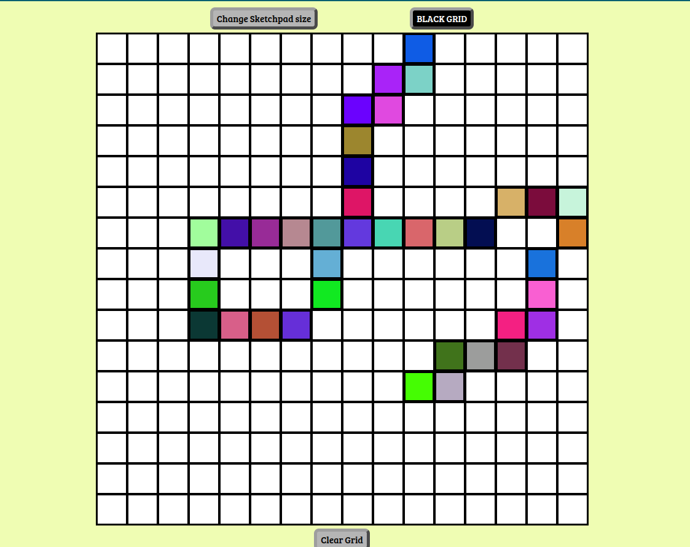

<h1>SKETCHPAD project</h1>

<h3>Description</h3>

Built a browser version of a Sketchpad .

<h3><a href="https://vjharan.github.io/etch_a_sketch_project/">view project</a></h3>

<h3>Project Screenshot</h3>

 

<h3>Features</h3>
<ul>
    <li>Default grid size : 16x16 squares</li>
    <li>Option to set custom sketchpad size in the range 1-100.</li>
    <li>Option to use RGB colored grid or Black colored Grid</li>
    <li>Option to clear current grid</li>
</ul>

<h3>How to use the Sketchpad:</h3>
<ul>
    <li>Users can hover the mouse over the small squares to create desired patterns on the sketchpad.</li>
    <li>Click 'Change Sketchpad size' button to input custom size between 1 and 100.</li>
    <li>Click on the adjacent button to toggle between 'RGB GRID' or 'BLACK GRID'.</li>
    <li>Click on the 'Clear Grid' button to clear the pattern on the current grid</li>
</ul>

<h3>Technologies used</h3>
<ul>
    <li>HTML5</li>
    <li>CSS</li>
    <li>JavaScript</li>
</ul>
